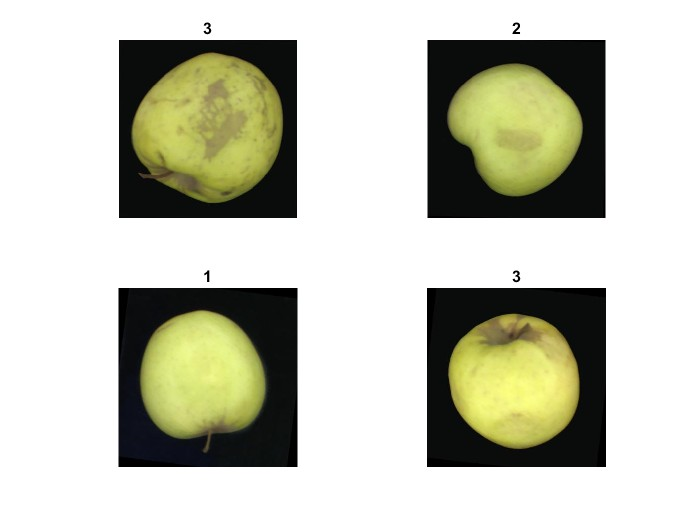
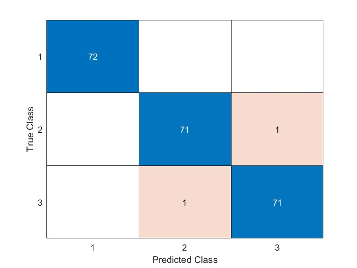

# A Transfer Learning–Based Approach for Grading Yellow Apples Using AlexNet, MobileNet, and GoogleNet

## Overview

This project proposes a transfer learning-based method to classify images of tree-grown yellow apples into three categories: Grade 1, Grade 2, and Reject. The dataset originally contains 40 images per class, which is increased to 360 images per class through data augmentation techniques, resulting in a total of 1080 images.

The augmented images are used to fine-tune three different pre-trained networks. After training, the models are tested on a separate test set to evaluate their classification performance.

---

## Sample Images

Below are some example images from the dataset used in this project:

---

## Results

The confusion matrix below (using MobileNetV2) shows the classification results on 216 test samples:

The matrix indicates excellent performance, with only 2 misclassifications:  
- 1 Grade 2 sample classified as Grade 3  
- 1 Reject sample classified as Grade 2

---

## Requirements

- MATLAB (for the provided codes)  
- Pre-trained networks: AlexNet, MobileNetV2, GoogleNet

---

## Usage

Run the provided MATLAB scripts in the `Matlab Codes` folder to reproduce training and evaluation.

---

Thank you for checking out this project!
